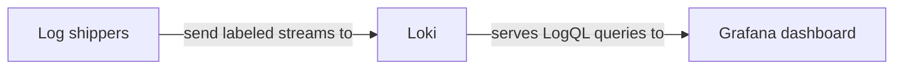

# Architecture

This project connects its data source to its Grafana dashboard through the components shown below.

## Overview

This diagram shows the data path for this project.



## Components

### Data source

Log shippers -> Loki streams labeled environment, host and source -> Grafana LogQL panels.

### Dashboard

`dashboards/homelab-logs.json` contains the Grafana dashboard definition.

## Data flow

Log shippers -> Loki streams labeled environment, host and source -> Grafana LogQL panels. Grafana evaluates dashboard queries against the selected data source and label values.

## Directory layout

```text
.
├── dashboards/  Grafana dashboard JSON files
├── docs/        Documentation source
└── README.md    Project overview and quick links
```
